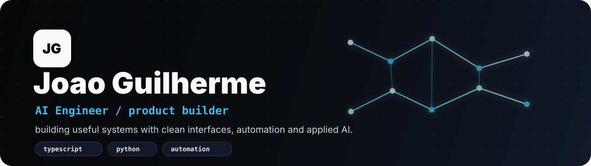

<p align="center">
  
</p>

<p align="center">
  
</p>

<br/>

<table>
  <tr>
    <td width="58%" valign="top">

### `joao.guilherme`

Eu curto construir coisas que parecem simples por fora, mas resolvem problema de verdade por dentro.

Meu foco hoje fica entre **apps web**, **ferramentas internas**, **automacoes** e produtos pequenos que saem rapido do papel.

```ts
const joaogdev = {
  mode: "builder",
  stack: ["TypeScript", "Python", "JavaScript"],
  craft: ["UI polish", "SaaS", "Dashboards", "Automation"],
  vibe: "clean interface, useful system, fast iteration",
  shipping: true
};
```

  </td>
  <td width="42%" valign="top">

### `status.panel`

```text
ONLINE       yes
FOCUS        product + code
EDITOR       VS Code
LOCATION     Brazil
ENERGY       idea -> deploy
```

<p>
  
  
  
</p>

  </td>
  </tr>
</table>

---

### `toolbox`

<p align="center">
  
</p>

---

### `things.i.like.to.build`

<table>
  <tr>
    <td width="25%"><b>Dashboards</b><br/>Interfaces para ler, decidir e agir rapido.</td>
    <td width="25%"><b>CRMs</b><br/>Fluxos internos para loja, estoque e financeiro.</td>
    <td width="25%"><b>Websites</b><br/>Paginas com visual forte e objetivo claro.</td>
    <td width="25%"><b>Automacoes</b><br/>Bots, scripts e tarefas repetitivas trabalhando sozinhas.</td>
  </tr>
</table>

---

### `current.quest`

```text
01  deixar projetos mais apresentaveis
02  melhorar produto, UI e experiencia
03  transformar ideias pequenas em sistemas reais
04  publicar mais coisa bonita por aqui
```

### `lab.metrics`

<table>
  <tr>
    <td align="center"><b>main stack</b><br/>TypeScript + Python</td>
    <td align="center"><b>favorite flow</b><br/>idea -> prototype -> deploy</td>
    <td align="center"><b>style</b><br/>dark UI, neon detail, clean layout</td>
  </tr>
</table>

<p align="center">
  <a href="https://github.com/joaogdev">
    
  </a>
  <a href="mailto:jhoaog8@gmail.com">
    
  </a>
  
</p>
